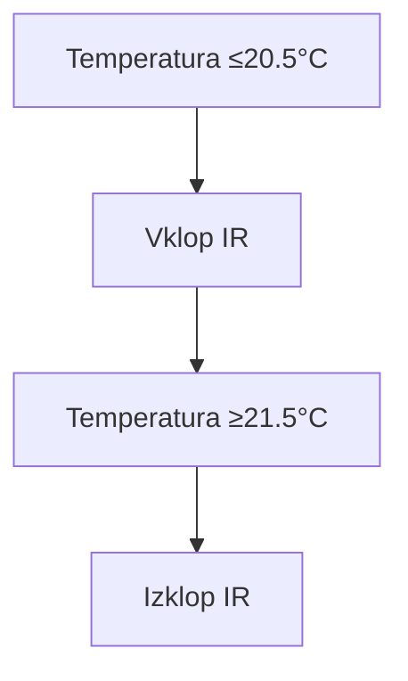
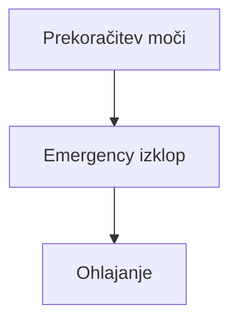

## 📜 Licenca  
Ta dela so prosto dostopna za vsako uporabo brez omejitev.  
Avtor ne zahteva atribucije, vendar je hvaležen za povratne informacije.

# 🐣 Projekt v razvoju
___

## Z naslednjimi nastavitvami želim doseči nadzor nad porabo maksimalno dovoljene dogovorjene moči (kW)!


***
# 🎯 Pojasniti vam moram, da živimo v dvo družinski hiši kjer imamo trenutno 1 odjemno merilno mesto!

***

Najprej sem moral rešiti dilemo glede uporabe električne pečice, pralnega stroja in sušilnega stroja. Z ženo sva se dogovorila 😄, da istočasno ne vklapljava teh naprav, tukaj pride v poštev tudi, friteza, mikrovalovna, fen za lase (opremljena so s pametnimi stikali ali pa vsaj z merilniki porabe) in še kaj se bi našlo.

Glede na to, da imamo prostore ogrevane s pomočjo IR panelov in da vodo greje bojler se mi dozdeva, da te naprave lahko brez večjega vpliva ob špicah izklapljam.


Najprej sem moral rešiti dilemo glede uporabe električne pečice, pralnega stroja in sušilnega stroja. Z ženo sva se dogovorila 😄, da istočasno ne vklapljava teh naprav, tukaj pride v poštev tudi, friteza, mikrovalovna, fen za lase (opremljena so s pametnimi stikali ali pa vsaj z merilniki porabe) in še kaj se bi našlo.

Glede na to, da imamo prostore ogrevane s pomočjo IR panelov in da vodo greje bojler se mi dozdeva, da te naprave lahko brez večjega vpliva ob špicah izklapljam.


# Nekaj podatkov o porabnikih
___
| Naprava        | Poraba |
|----------------|--------|
| Sušilni stroj  | 2,5 kW |
| Pralni stroj   | 1,8 kW |
| Bojler         | 2,0 kW |
| Pečica         | 2,0 kW |
| Mikrovalovna   | 1,8 kW |
| Likalnik       | 2,2 kW |
| Fen za lase    | 2,4 kW |
| IR Nati        | 0,6 kW |
| IR Spalnica    | 1,2 kW |
| IR Di          | 0,7 kW |
___ 

Upoštevana je maksimalna poraba ob zagonu naprave,ki je nekoliko višja koz kasneje nadaljevanj

📊 Ugotovil sem, da je nekje stalna poraba okoli 500 W (hladilnik, skrinja, tv, glavni računalnik ...) tako, da čisto v skrajnost ne mislim iti!


⚡ Oziroma je stalna poraba: Internet, mrežno stikalo, mrežni tiskalnik, računalnik (Home assistant in Windows `podatkovni strežnik, domači kino, kamere ...` "na Proxmox") dnevno:


Primer poimenovanja entitet:

| Entiteta  | Pomen                            |
|-----------|----------------------------------|
| Me-Ss     | Merilnik elektrike-Sušilni stroj |
| Me-Ps     | Merilnik elektrike-Pralni stroj  |
| Me-Bo     | Merilnik elektrike-Bojler        |
| Tm-Sp     | Temperaturni merilnik-Spalnica   |

___
### ✨
___
### 🧠 Za avtomatizacijo/nadzor uporabljam dodatek Node-red in ne avtomatizacijo predvsem zaradi boljše preglednosi nad potekom avtomatizacije/nadzora.
***
# 📅 Dodano: 19.04.2025

Poglejmo porabo pralnega stroja (Me-Ps) in sušilnega stroja (Me-Ss):

Prvo je prano belo perilo in nato sušeno zatem je prano pisano perilo in zatemm sušeno.

Pralni stroj (Me-Ps) belo perilo:


Sušilni stroj (Me-Ss):


***
# 📅 Popravljeno: 19.05.2025
Po tehtnem premisleku sem se lotil tudi nadzora nad pralnim in sušilnim strojem zaradi bolj robustnega nadzora:


✍️ Koda v nod-red za prenos: 
[20250519-pralni in sušilni stroj + emergency flows.zip](https://github.com/user-attachments/files/20280628/20250519-pralni.in.susilni.stroj.%2B.emergency.flows.zip)

___
Ta zavihek vsebuje dva toka (flow-a). Čisto zgoraj je tok, ki skrbi za nadzor delovanja nad vsemi napravami gled na njihovo porabo in skupno porabo (opisano kasnjeje podrobneje), spodnji tok pa skrbi za delovanje pralnega in sušilnega stroja s pomočjo zgornjega toka, ki skrbi za delovanje tudi drugih naprav, ki jih bom opisal kasneje
___
# 🔌 1.) Emergency Power Management Flow - Popoln opis

## 🌟 Opis flow-a

Ta flow v Node-RED nenehno spremlja porabo električne energije na **fazi 3** preko senzorja `p1_meter_power_phase_3` in aktivira emergency protokol, ko poraba preseže nastavljeno mejo.

---

## 📊 Komponente flow-a

### 1. `server-state-changed` node
- 👁️ Sledi spremembam vrednosti senzorja `p1_meter_power_phase_3`
- 🔄 Pošilja podatke samo ob spremembi vrednosti
- 📦 Nastavi:
  - `msg.payload` = trenutna poraba (W)
  - `msg.topic` = `"sensor.p1_meter_power_phase_3"`

### 2. `function` node: *Upravljanje napajanja v sili*
- 🧠 Glavna logična enota za emergency upravljanje
- ⚠️ Implementira:
  - Sledenje porabi v realnem času
  - Prioritiziran sistem izklopov
  - Zaščitne mehanizme

### 3. `server` node
- 🏠 Povezava s Home Assistant sistemom
- 🔗 Omogoča integracijo z ostalimi pametnimi napravami

---

## ⚙️ Podrobnosti delovanja

### 🔄 Prioritetno zaporedje izklopov

```javascript
const emergencySequence = [
    'bojler',     // ♨️ Najmanj kritična naprava
    'irNa',       // 🌞 IR panel Nathalie
    'irSp',       // 🛏️ IR panel spalnica
    'irDi',       // 👧 IR panel Diane
    'susilni',    // 🔥 Sušilni stroj
    'pralni'      // 🧺 Pralni stroj (najbolj kritičen)
];
```
---

## 🛡️ Varnostni mehanizmi

- ⏱️ **5-sekundni zaščitni zamik** med zaporednimi izklopi  
- 🧪 **Preverjanje svežosti podatkov (timeout 10s):**

```javascript
if (currentTime - global.get('last_phase3_update') > 10000) {
    node.warn("⚠️ OPOZORILO: Zastareli podatki!");
}
```
---

## 📑 Obsežno logiranje vseh dogodkov

Sistem zapisuje vsak dogodek, ki vključuje:
- sprožitev ali ponastavitev emergency režima
- izklop posamezne naprave
- opozorila o zastarelih podatkih

---

## 📤 Primeri izhodnih sporočil

### 🚨 Emergency režim

```json
{
  "event": "EMERGENCY_TRIGGERED",
  "device": "bojler",
  "power": 4820,
  "timestamp": "2023-11-15T14:23:45Z"
}
```
### ✅ Normalno stanje

```json
{
  "event": "POWER_NORMALIZED",
  "power": 4200,
  "timestamp": "2023-11-15T14:25:30Z"
}
```
## 🛠️ Konfiguracija

| Parameter              | Vrednost | Opis                           |
|------------------------|----------|--------------------------------|
| `max_dovoljena_poraba` | 4650 W   | Nastavljiva meja               |
| `zaščitni_zamik`       | 5 s      | Časovni zamik med izklopi      |
| `timeout_podatkov`     | 10 s     | Preverjanje svežosti podatkov  |

---

## 🌈 Delovni primer

1. Sistem zazna porabo **4800W** (> 4650W)
2. Izklopi ♨️ **bojler** (prvi v zaporedju)
3. Če po **5 sekundah** poraba še vedno presežena:
   - Izklopi 🌞 **IR panel Nathalie**
4. Ko poraba pade pod mejo:
   - ✅ Ponastavi vse *emergency flag-e*
   - 📝 Zabeleži dogodek v dnevnik
___

Koda funkcije:
``` javascript
// === Upravljanje napajanja v sili ===
const phase3 = parseFloat(msg.payload) || 0; // Pridobi podatke iz vhodnega noda in jih shrani v phase3.
const lastEmergencyTime = flow.get('lastEmergencyTime') || 0;
const currentTime = Date.now();

// NASTAVITEV IN POSODOBITEV GLOBALNE SPREMENLJIVKE (ker je to edini vir podatkov)
global.set('phase3', phase3);  // Nastavitev globalnega objekta pod imenom phase3
global.set('last_phase3_update', currentTime);  // Za sledenje svežini podatkov
global.set('max_dovoljena_poraba', 4650); // Privzeta vrednost za maksimalno dovoljeno energijo

// Določi prioritetno zaporedje izklopov
const emergencySequence = [
    'bojler',
    'irNa',
    'irSp', 
    'irDi',
    'susilni',
    'pralni'
];

// Preveri svežost podatkov
if (currentTime - (global.get('last_phase3_update') || 0) > 10000) {
    node.warn("⚠️ OPOZORILO: Podatki phase3 niso sveži!");
}
// Nastavitev konstante za maksimalno dovoljeno energijo
const maxPoraba = parseFloat(global.get('max_dovoljena_poraba')) || 4650; 
// Pridobi VSE potrebne gobalne vrednosti in status iz drugih zavihkov in flowov v njih
const boilerState = global.get('boilerState') || 'off';  // Stanje bojlerja
const boilerPower = parseFloat(global.get('boilerPower') || 0);  // Poraba energije bojlerja
const pralniStanje = global.get('pralni_stanje') || 'off';
const pralniPoraba = parseFloat(global.get('pralni_poraba') || 0);
const susilniStanje = global.get('susilni_stanje') || 'off';
const susilniPoraba = parseFloat(global.get('susilni_poraba') || 0);
// IR panelei
const irNaState = global.get('irSwitchState_na') || 'off';
const irNaPoraba = parseFloat(global.get('irPoraba_na') || 0);
const irSpState = global.get('irSwitchState_sp') || 'off';
const irSpPoraba = parseFloat(global.get('irPoraba_sp') || 0);
const irDiState = global.get('irSwitchState_di') || 'off';
const irDiPoraba = parseFloat(global.get('irPoraba_di') || 0);
// V emergency funkciji ohranite obstoječe
const activeDevices = {irSp: global.get('irSpStatus') === 'AKTIVEN'};

// Pripravi debug sporočilo
const debugMsg = `
⚡️ STANJE URGENCE ⚡️
┏
┃ 🔌 Faza 3: ${phase3}W ${phase3 <= maxPoraba ? '✅' : '❌'} (meja: ${maxPoraba})
┃ ♨️ Bojler: ${boilerState.toUpperCase()} ${boilerPower}W ${boilerState === 'AKTIVEN' ? '🔴' : '🟢'}
┃ 🌞 IR Nathalie: ${irNaState.toUpperCase()} ${irNaPoraba}W ${irNaPoraba > 100 ? '🔴' : '🟢'}
┃ 🛏️ IR Spalnica: ${irSpState.toUpperCase()} ${irSpPoraba}W ${irSpPoraba > 100 ? '🔴' : '🟢'}
┃ 👧 IR Diane: ${irDiState.toUpperCase()} ${irDiPoraba}W ${irDiPoraba > 100 ? '🔴' : '🟢'}
┃ 🧺 Pralni: ${pralniStanje.toUpperCase()} ${pralniPoraba}W ${pralniPoraba > 120 ? '🔴' : '🟢'}
┃ 🔥 Sušilni: ${susilniStanje.toUpperCase()} ${susilniPoraba}W ${susilniPoraba > 240 ? '🔴' : '🟢'}
┗
${phase3 > maxPoraba ? '🚨 PREKORAČITEV MOČI!' : '✅ Normalna poraba'}`;

node.warn(debugMsg);

// Preveri prekoračitev moči
if (phase3 > maxPoraba) {
    // Če je prva prekoračitev ali je minilo 5 sekund od zadnje
    if (currentTime - lastEmergencyTime > 5000) {
        // Pridobi trenutno aktivne naprave
        const activeDevices = {
            bojler: global.get('boilerState') === 'AKTIVEN',
            irNa: global.get('irNaStatus') === 'AKTIVEN',
            irSp: global.get('irSpStatus') === 'AKTIVEN',
            irDi: global.get('irDiStatus') === 'AKTIVEN',
            susilni: global.get('susilniStatus') === 'AKTIVEN',
            pralni: global.get('pralniStatus') === 'AKTIVEN'
        };
        
        // Najdi prvo aktivno napravo v zaporedju za izklop
        const deviceToTurnOff = emergencySequence.find(device => activeDevices[device]);
        
        if (deviceToTurnOff) {
            // Nastavi globalni flag za izklop
            global.set(`emergency_${deviceToTurnOff}_off`, true);
            flow.set('lastEmergencyTime', currentTime);
            
            node.warn(`⚠️ EMERGENCY: Zahtevan izklop ${deviceToTurnOff}`);
            
            // Dodatno sporočilo za debug
            msg.payload = {
                event: "EMERGENCY_TRIGGERED",
                dogodek: "URGENCA_AKTIVIRANA",
                device: deviceToTurnOff,
                phase3: phase3,
                timestamp: new Date(currentTime).toISOString()
            };
            
            return msg;
        } else {
            node.warn('ℹ️ EMERGENCY: Vse naprave so že izklopljene');
        }
    } else {
        // Čakamo še na potek 5s zamika za ponovno preverbo
        const remaining = (5000 - (currentTime - lastEmergencyTime)) / 1000;
        node.warn(`⏳ EMERGENCY: Čakamo na potek 5s zamika (preostalo: ${remaining.toFixed(1)}s)`);
    }
} else {
    // Ponastavi vse emergency flag-e, če je poraba normalna
    emergencySequence.forEach(device => {
        global.set(`emergency_${device}_off`, false);
    });
    
    // Ponastavi števec časa
    flow.set('lastEmergencyTime', 0);
    
    // Debug sporočilo
    msg.payload = {
        event: "POWER_NORMALIZED",
        dogodek: "MOČ_NORMALIZIRANA",
        phase3: phase3,
        timestamp: new Date().toISOString()
    };
    
    return msg;
}

return null;
```
___
# 🌀 2.) Flow: Avtomatsko upravljanje pralnega in sušilnega stroja

## 🔍 Kratek opis

Ta Node-RED flow skrbi za pametno upravljanje **pralnega** in **sušilnega stroja**, glede na:

- trenutno **porabo elektrike**
- stanje naprav (vklop/izklop)
- in **emergency logiko**, če pride do presežene skupne porabe (glede na fazo 3)

Cilj sistema je:
- preprečiti preobremenitev električnega omrežja
- avtomatsko nadzorovati naprave
- **obveščati uporabnike** preko mobilne aplikacije Home Assistant companion če sta prisotnosti osebi Mojca ali Robert ob vklopu ali izklopu naprave

---

## 🧠 Glavne komponente

### 🔧 Glavna funkcija (`function` node: "Funkcija PSs")

Ta vozlišče sprejema podatke iz senzorjev porabe in stanja naprav ter izvaja naslednje logike:

- spremlja porabo pralnega in sušilnega stroja
- beleži stanje (vklop/izklop) pametnega stikala naprav
- izračuna trenutno porabo faze 3
- primerja s skupnim dovoljenim limitom (`max_dovoljena_poraba`)
- izvaja:
  - **emergency izklop** (če presežena moč)
  - **avtomatski vklop**, če je na voljo dovolj moči preko prej omenjene funkcije

🧮 Primer konfiguracije:

```javascript
const maxPoraba = parseFloat(global.get('max_dovoljena_poraba')) || 4650;
```

---

## 🖥️ Spremljanje stanj

### Entitete, ki sprožijo flow:

- `sensor.me_prst_current_consumption` (poraba pralnega stroja)
- `sensor.me_ss_current_consumption` (poraba sušilnega stroja)
- `switch.me_ps` (stanje pametnega stikala pralnega stroja)
- `switch.me_ss_switch_0` (stanje pametnega stikala sušilnega stroja)

Vse zgornje entitete so povezane z `server-state-changed` vozlišči in priklopljene na glavno funkcijsko vozlišče.

---

## 🔁 Emergency logika

- Če je `global.get('emergency_pralni_off') == true`, se pralni stroj **takoj izklopi**
- Enako za `emergency_susilni_off` in sušilni stroj- Za izklop skrbi zgornji flow
- Po izklopu se preveri, ali je uporabnik (Mojca ali Robert) doma
- Če je prisoten, se mu pošlje **obvestilo preko mobilne aplikacije Home assistant companion**

📦 Obvestilo:

```json
{
  "message": "Sušilni stroj se je IZKLOPIL. Prekoračena poraba",
  "title": "Obvestilo: Sušilni stroj"
}
```

---

## 🔔 Obvestila uporabnikom

Obvestila se pošiljajo preko:

- `notify.mobile_app_mojca_mobitel`
- `notify.mobile_app_robert_mobitel`

### Vsebina vključuje:

- **naslov obvestila** (npr. “Obvestilo: Pralni stroj”)
- **sporočilo** z dodatnimi podatki o porabi
- **akcijski gumb**: `Videl sem 👍`
- različno pomembnost glede na uporabnika (Robert dobi alarm)

---

## 🔄 Avtomatski vklopi

Če skupna poraba pade **pod dovoljeno mejo**, sistem:

1. ponastavi emergency zastavice
2. preveri stanje naprav
3. po potrebi **vklopi najprej pralni stroj**, če je na voljo ≥ 1920 W + rezerva
4. nato šele sušilni stroj, če je na voljo ≥ 2500 W + rezerva

📥 Primer logike za vklop pralnega stroja:

```javascript
if (pralniStanje === 'off' && !pralniStatus.includes('AKTIVEN') && prostaMoc >= (1920 + rezerva)) {
    return [null, null, { payload: "on" }, null];
}
```

---

## ♻️ Osveževanje podatkov

Flow vključuje tudi `inject` node, ki vsakih **5 sekund** pošlje `force_refresh` sporočilo, da se ponovno prebere trenutna vrednost iz `global.get('phase3')`.

---

## 💾 Pomožne spremenljivke

- `global.phase3` – trenutno stanje porabe na fazi 3
- `flow.pralni_poraba` in `flow.susilni_poraba` – poraba posameznih naprav
- `flow.pralni_stanje`, `flow.susilni_stanje` – stanja naprav
- `global.last_phase3_update` – čas zadnje osvežitve
- `global.emergency_pralni_off`, `global.emergency_susilni_off` – emergency zastavice

---

## 📋 Povzetek v obliki tabele

| Komponenta            | Opis                                                 |
|-----------------------|------------------------------------------------------|
| `switch.me_ps`        | Stikalo pralnega stroja                              |
| `switch.me_ss`        | Stikalo sušilnega stroja                             |
| `sensor.me_prst...`   | Poraba pralnega stroja                               |
| `sensor.me_ss...`     | Poraba sušilnega stroja                              |
| `function` node       | Glavna logika za izklop/vklop/emergency obdelavo     |
| `inject` node         | Periodično proži osvežitev                           |
| `notify.*`            | Pošiljanje obvestil uporabnikom                      |
| `current-state` node  | Preverjanje ali sta Mojca ali Robert doma            |

---

## 🧪 Primer poteka

1. Poraba naraste nad 4650 W
2. Flow izklopi sušilni stroj
3. Če je kdo doma (Mojca/Robert) → prejme obvestilo
4. Ko poraba pade:
   - sistem preveri, koliko moči je na voljo
   - najprej vklopi pralni, nato še sušilni stroj
   - pošlje obvestilo o ponovnem vklopu

---

## 🔚 Zaključek

Ta flow omogoča **dinamično in varno upravljanje gospodinjskih aparatov**, prilagojeno prisotnosti stanovalcev in trenutnim energetskim razmeram. Primeren je za okolja, kjer je **omejena priključna moč** in je potrebno pazljivo načrtovanje vklopov večjih porabnikov.
___

Koda funkcije
```javascript
// ===== FUNKCIJA PRALNO-SUŠILNI STROJ =====
// Izhodi:
// [0] Izklop sušilnega stroja
// [1] Izklop pralnega stroja 
// [2] Vklop pralnega stroja
// [3] Vklop sušilnega stroja

// Prisilno osveževanje podatkov preko inject noda
if (msg.topic === "force_refresh") { // Preveri, ali je tema (topic) dobljenega sporočila enaka nizu "force_refresh".
    msg.payload = global.get('phase3') || 0; // Prebere globalno vrednost 'phase3' ali vrne 0, če ne obstaja
    msg.topic = "sensor.p1_meter_power_phase_3"; // Spremeni temo sporočila
}

// === INICIALIZACIJA ===
const currentValue = parseFloat(msg.payload) || 0;
const entityId = msg.topic || (msg.data && msg.data.entity_id) || (msg._event && msg._event.entity_id);  // Prepoznati, katera naprava/entiteta je poslala podatek.
const maxPoraba = parseFloat(global.get('max_dovoljena_poraba')) || 4650;

// === SHRAJEVANJE PODATKOV GLEDE NA ENTITETO ===
if (entityId === 'sensor.me_prst_current_consumption') {
    flow.set('pralni_poraba', currentValue);  // Shrani v flow
    global.set('pralni_poraba', currentValue);  // Shrani v globalno spremenljivko
} 
else if (entityId === 'sensor.me_ss_current_consumption') {
    flow.set('susilni_poraba', currentValue);
    global.set('susilni_poraba', currentValue);
} 
else if (entityId === 'switch.me_ps') {
    flow.set('pralni_stanje', msg.payload);
    global.set('pralni_stanje', msg.payload);
} 
else if (entityId === 'switch.me_ss' || entityId === 'switch.me_ss_switch_0') {
    flow.set('susilni_stanje', msg.payload);
    global.set('susilni_stanje', msg.payload);
}

// === BRANJE TRENUTNIH STANJ ===
const porabaFaze3 = parseFloat(global.get('phase3')) || 0; // Globalna spremenljivka
global.set('last_phase3_update', Date.now());  // Shrani se čas osvežitve
const pralniPoraba = parseFloat(flow.get('pralni_poraba')) || 0;
const susilniPoraba = parseFloat(flow.get('susilni_poraba')) || 0;
const pralniStanje = flow.get('pralni_stanje') || 'off';
const susilniStanje = flow.get('susilni_stanje') || 'off';

// === DOLOČANJE STATUSOV  IN LEPŠI PRIKAZ V DEBUG ===
const pralniStatus = (pralniStanje === 'on' && pralniPoraba > 120) ? '🔴 AKTIVEN' : '🟢 neaktiven';
const susilniStatus = (susilniStanje === 'on' && susilniPoraba > 240) ? '🔴 AKTIVEN' : '🟢 neaktiven';

// Preverjanje svežosti podatkov
const lastUpdate = global.get('last_phase3_update') || 0;
if (Date.now() - lastUpdate > 10000) {
    node.warn("⚠️ OPOZORILO: Globalni podatki niso sveži!");
}

// === EMERGENCY LOGIKA ZA IZKLOP===
const emergencyPralniOff = global.get('emergency_pralni_off') || false;
const emergencySusilniOff = global.get('emergency_susilni_off') || false;
// EMERGENCY FUNKCIJA IZKLOPI PRALNI STROJ
if (emergencyPralniOff && pralniStanje === 'on') {
    node.warn('⛔ EMERGENCY: Izklop pralnega stroja');
    return [null, { payload: "off" }, null, null];
}
// EMERGENCY FUNKCIJA IZKLOPI SUŠILNI STROJ
if (emergencySusilniOff && susilniStanje === 'on') {
    node.warn('⛔ EMERGENCY: Izklop sušilnega stroja');
    return [{ payload: "off" }, null, null, null];
}

// === NORMALNO DELOVANJE PONOVNI VKLOP PO POTREBI ===
if (porabaFaze3 <= maxPoraba) {
    // Reset emergency stanja
    flow.set('lastEmergencyAlert', 0);
    
    const prostaMoc = maxPoraba - porabaFaze3;
    const rezerva = 50;
    
    // Pralni stroj ima prednost (1920W + rezerva)
    if (pralniStanje === 'off' && !pralniStatus.includes('AKTIVEN') && prostaMoc >= (1920 + rezerva)) {
        node.warn(`✅ AVTOMATSKI VKLOP: Pralni stroj (prosta moč: ${prostaMoc}W)`);
        return [null, null, { payload: "on" }, null];
    }
    // Sušilni stroj (2500W + rezerva)
    else if (susilniStanje === 'off' && !susilniStatus.includes('AKTIVEN') && prostaMoc >= (2500 + rezerva)) {
        node.warn(`✅ AVTOMATSKI VKLOP: Sušilni stroj (prosta moč: ${prostaMoc}W)`);
        return [null, null, null, { payload: "on" }];
    }
    else {
        node.warn(`ℹ️ Ohranjanje stanja (prosta moč: ${prostaMoc}W)`);
        return [null, null, null, null];
    }
}

// Če pridemo do sem, vrni prazne izhode
return [null, null, null, null];
```
***

# 📅 Popravljeno: 19.05.2025
💡 Primer za bojler ki ima najnižjo prioriteto delovanja (se prvi izklaplja).


✍️ Koda v nod-red za prenos: 
[20250519-Bojler flows.zip](https://github.com/user-attachments/files/20281763/20250519-Bojler.flows.zip)

___
# ♨️ Bojler Flow - Avtomatsko upravljanje

## 🌟 Opis flow-a
Ta Node-RED flow avtomatsko upravlja delovanje bojlerja glede na:
- Trenutno porabo energije (`sensor.me_bo_current_consumption`)
- Stanje stikala (`switch.me_bo`)
- Emergency stanje sistema

### 📊 Komponente flow-a

1. **`server-state-changed` node**  
   - 👁️ Sledi spremembam porabe bojlerja (`sensor.me_bo_current_consumption`)
   - 🔄 Pošilja podatke ob vsaki spremembi
   - 📦 Nastavi:
     - `msg.payload`: trenutna poraba (W)
     - `msg.topic`: ime senzorja

2. **`inject` node**  
   - ⏲️ Vsakih 5 minut pošlje signal za osvežitev podatkov
   - 🔄 Zagotavlja redno posodabljanje stanja

3. **`function` node "Funkcija bojler"**  
   - 🧠 Glavna logična enota (opisana spodaj)
   - ⚠️ Ima dva izhoda:
     - Vklop bojlerja
     - Izklop bojlerja

4. **`api-call-service` node**  
   - 🏗️ Izvaja ukaze v Home Assistant:
     - Vklop (`turn_on`)
     - Izklop (`turn_off`)

## ⚙️ Podrobnosti delovanja funkcije

### 🔄 Inicializacija
```javascript
// Inicializacija globalnih spremenljivk
if (global.get('boilerPower') === undefined) global.set('boilerPower', 0);
if (global.get('boilerSwitchState') === undefined) global.set('boilerSwitchState', 'off');
if (global.get('phase3') === undefined) global.set('phase3', 0);
```

# ♨️ Podrobna razlaga delovanja bojler flow-a

## 🔍 Obdelava vhodnih podatkov

### ⚡ Poraba energije
```javascript
if (msg.topic === 'sensor.me_bo_current_consumption') {
  const poraba = parseFloat(msg.payload) || 0;
  global.set('boilerPower', poraba);
  posodobiBoilerStatus();
}
```

Preverja sporočila s tematiko porabe energije

Pretvori vrednost v število (0 če napaka)

Shrani v globalno spremenljivko `boilerPower`

Avtomatsko posodobi status bojlerja

# ♨️ Podrobna razlaga delovanja bojler flow-a

## 🔘 Stanje stikala
```javascript
else if (msg.topic === 'switch.me_bo' && ['on','off'].includes(msg.payload)) {
  global.set('boilerSwitchState', msg.payload);
  posodobiBoilerStatus();
}
```

# ♨️ Upravljanje Bojlerja v Node-RED

Ta skripta obdeluje spremembe stanja stikala za bojler ter avtomatsko upravlja njegovo delovanje na podlagi porabe električne energije in zaščitnih mehanizmov.

---

## ✅ Veljavna stanja

Sprejeta stanja stikala:

- `on`
- `off`

---

## 🔁 Sinhronizacija stanja

Ob vsaki spremembi:

- Se **posodobi globalna spremenljivka** `boilerSwitchState`
- Sproži se **ponovno izračunavanje statusa** bojlerja

---

## 📊 Debug izpis

```javascript
const debugMsg = `♨️ STANJE BOJLERJA
┌
│  🏷️ STIKALO    ${global.get('boilerSwitchState').toUpperCase()} 
│  🔧 STATUS     ${global.get('boilerState').toUpperCase()}
│  ⚡ PORABA      ${global.get('boilerPower')}W
└`;
node.warn(debugMsg);
```

# 🔥 Pametno upravljanje bojlerja z Node-RED

Ta logika omogoča varno in učinkovito upravljanje električnega bojlerja v realnem času s pomočjo **Node-RED**, senzorjev porabe in Home Assistant integracije.

---

## 🧩 Prikazuje

- 🔘 **Trenutno stanje stikala** (ON/OFF)
- 🛠️ **Status bojlerja** (AKTIVEN / neaktiven)
- ⚡ **Trenutno porabo** v W
- 🎨 **Uporabo emojijev** za boljšo preglednost v Node-RED konzoli

---

## 🚨 Emergency izklop

```javascript
if (global.get('emergency_bojler_off') && trenutniPodatki.switchState === 'on') {
    flow.set('lastBoilerTurnOffTime', Date.now());
    return [null, { payload: "off" }];
}
```
### Pogoji:
- `emergency_bojler_off` je `true`
- Bojler je trenutno **vklopljen**

### Akcije:
- 🕒 Zabeleži čas izklopa
- 📴 Pošlje ukaz za izklop
- 🛡️ Prepreči preobremenitev omrežja

## ⏱️ Avtomatski vklop

```javascript
if (trenutniPodatki.phase3 <= 2100 && trenutniPodatki.switchState === 'off') {
    const lastTurnOffTime = flow.get('lastBoilerTurnOffTime') || 0;
    if (Date.now() - lastTurnOffTime >= 300000) {
        return [{ payload: "on" }, null];
    }
}
```

### Pogoji:
- 📉 Poraba faze 3 ≤ **2100W**
- 🔌 Bojler je izklopljen
- ⏳ Minilo je **vsaj 5 minut** od zadnjega izklopa

### Akcija:
- 🔁 Pošlje ukaz za **vklop bojlerja**

## 🛠️ Konfiguracijske nastavitve

| Parameter               | Vrednost   | Opis                                                       |
|-------------------------|------------|------------------------------------------------------------|
| `max_dovoljena_poraba`  | 4650 W     | Mejna vrednost za sprožitev emergency režima               |
| `zaščitni_zamik`        | 5 minut    | Minimalni čas med avtomatskim vklopom po izklopu           |
| `osveževanje`           | 5 minut    | Interval samodejnega preverjanja podatkov v Node-RED flowu |

## 🌈 Delovni primeri

### 1️⃣ Normalno delovanje

| Pogoj           | Rezultat                |
|----------------|--------------------------|
| Poraba ≤ 2100W | ✅ Bojler se lahko vklopi |
| Poraba > 2100W | ⛔ Bojler ostane izklopljen |

### 2️⃣ Emergency scenarij

- ⚠️ Zaznana **preobremenitev omrežja**
- `emergency_bojler_off = true`
- 🔌 Bojler se **takoj izklopi**
- 🛡️ Omrežna zaščita se **aktivira**

### 3️⃣ Ročno upravljanje

- 👆 Stikalo `switch.me_bo` omogoča **ročno upravljanje**
- 🔄 Sistem še vedno spoštuje varnostne mehanizme
- 🔐 Ročno vklopljen bojler bo izklopljen ob emergency pogoju

## 💡 Razširljivost

- ➕ Enostavno dodajanje novih naprav z minimalnimi spremembami v kodi
- 🧠 Vsa logika temelji na **globalnih spremenljivkah** in osrednjemu nadzoru
- ⚙️ Sistem se lahko razširi na **večfazne** porabnike ali dodatne scenarije

## 🧪 Diagnostika in testiranje

| Kaj preveriti                          | Orodje / metoda              |
|----------------------------------------|------------------------------|
| Stanje `switchState`                   | `debug` node / `node.warn()` |
| Porabo `phase3`                        | Preveri senzor v HA          |
| Čas `lastBoilerTurnOffTime`            | Uporabi `flow.get()`         |
| Vrednost `emergency_bojler_off`        | Preveri z `global.get()`     |
| Odziv na ročno vklop / izklop stikala  | Spremljaj `switch.me_bo`     |

## 📡 Tehnične zahteve

- ✅ **Node-RED** okolje (verzija 3.x ali višje priporočena)
- ✅ **Home Assistant** ali drug MQTT strežnik
- ✅ Aktivni senzorji:
  - `switch.me_bo` – stikalo za bojler
  - `sensor.phase3_power` – trenutna poraba faze 3

## 📌 Shema poteka

```
[Senzorji (MQTT / HA)]
        │
        ▼
[Function Node: Upravljanje bojlerja]
        │
   ┌────┴────┐
   ▼         ▼
[Stikalo] [Debug / Notification]
```

## 🔐 Varnostne opombe

- Sistem nikoli ne vklopi bojlerja, če bi to **preseglo porabniški limit**
- Ročni vklop **ne zaobide varnostnih pogojev**
- Emergency izklop je **neodvisen od uporabnika** in temelji izključno na senzorjih


___

___
Koda funkcije:
```javascript
// === BOJLER - AVTOMATSKO UPRAVLJANJE ===
// Izhodi:
// [0] Vklop bojlerja
// [1] Izklop bojlerja

// ===== INICIALIZACIJA GLOBALNIH SPREMENLJIVK NUJO =====
if (global.get('boilerPower') === undefined) global.set('boilerPower', 0);
if (global.get('boilerSwitchState') === undefined) global.set('boilerSwitchState', 'off');
if (global.get('phase3') === undefined) global.set('phase3', 0);
const maxPoraba = parseFloat(global.get('max_dovoljena_poraba')) || 4650;

// ===== OBDELAVA INJECT OSVEŽEVANJA PODATKOV =====
if (msg.topic === "force_refresh_boiler") {
    msg = {
        payload: {
            phase3: parseFloat(global.get('phase3')),  // Brez || 0, ker je že inicializiran
            boilerPower: parseFloat(global.get('boilerPower')),  // Brez || 0
            switchState: global.get('boilerSwitchState')  // Brez || 'off'
        },
        topic: "rocno_osvezeno"
    };
    node.warn("🔁 Osvežujem podatke za bojler");
}

// ===== OBDELAVA VHODNIH PODATKOV =====
let obdelano = false;
// Stanje bojlerja
function posodobiBoilerStatus() {
    const power = parseFloat(global.get('boilerPower')) || 0;
    const switchState = global.get('boilerSwitchState');
    const newStatus = (switchState === 'on' && power > 100) ? 'AKTIVEN' : 'neaktiven';
    global.set('boilerState', newStatus);
    return newStatus;
}

// Obdelava porabe
if (msg.topic === 'sensor.me_bo_current_consumption') {
    const poraba = parseFloat(msg.payload) || 0;
    global.set('boilerPower', poraba);
    posodobiBoilerStatus(); // Samo enkrat nastavi status
    obdelano = true;
} 
// Obdelava stikala
else if (msg.topic === 'switch.me_bo' && ['on','off'].includes(msg.payload)) {
    global.set('boilerSwitchState', msg.payload);
    posodobiBoilerStatus(); // Samo enkrat nastavi status
    obdelano = true;
}

// ===== PRIKAZ TRENUTNEGA STANJA (DEBUG) =====
const trenutniPodatki = msg.topic === "rocno_osvezeno" ? msg.payload : {
    phase3: parseFloat(global.get('phase3')) || 0,
    boilerPower: parseFloat(global.get('boilerPower')) || 0,
    switchState: global.get('boilerSwitchState') || 'off'
};

if (msg.topic === "rocno_osvezeno" || obdelano) {
    const debugMsg = `♨️ STANJE BOJLERJA
    ┌
    │  🏷️ STIKALO    ${global.get('boilerSwitchState').toUpperCase()} ${global.get('boilerSwitchState') === 'on' ? '🟢' : '🔴'}
    │  🔧 STATUS     ${global.get('boilerState').toUpperCase()} ${global.get('boilerState') === 'AKTIVEN' ? '🔴' : '🟢'}
    │  ⚡ PORABA      ${global.get('boilerPower')}W ${global.get('boilerState') === 'AKTIVEN' ? '🔴' : '🟢'} 
    └`;
    node.warn(debugMsg);
}

// ===== GLAVNA LOGIKA UPRAVLJANJA =====

// 1. EMERGENCY IZKLOP (samo če je globalni flag aktiven)
if (global.get('emergency_bojler_off') && trenutniPodatki.switchState === 'on') {
    flow.set('lastBoilerTurnOffTime', Date.now()); // Shrani čas izklopa
    node.warn(`⛔ EMERGENCY IZKLOP: Poraba=${trenutniPodatki.phase3}W, Stanje=${global.get('boilerState')}`);
    return [null, { payload: "off" }];
}

// 2. AVTOMATSKI VKLOP (z 5-minutno zakasnitvijo)
if (trenutniPodatki.phase3 <= 2100 && trenutniPodatki.switchState === 'off') {
    const lastTurnOffTime = flow.get('lastBoilerTurnOffTime') || 0;
    const currentTime = Date.now();
    const minDelay = 5 * 60 * 1000; // 5 minut v milisekundah

    if (currentTime - lastTurnOffTime >= minDelay) {
        node.warn(`✅ AVTOMATSKI VKLOP: Poraba ${trenutniPodatki.phase3}W ≤ 2100W`);
        return [{ payload: "on" }, null];
    } else {
        const remainingSec = Math.round((minDelay - (currentTime - lastTurnOffTime)) / 1000);
        node.warn(`⏳ Zamik vklopa: še ${remainingSec} sekund`);
        return [null, null];
    }
}

// 3. NORMALNO STANJE - brez sprememb
node.warn("ℹ️ Ohranjam trenutno stanje");
return [null, null];
```
***

# 📅 Popravljeno: 19.05.2025
💡 Primer za IR panel (ogrevanje):


✍️ Koda v nod-red za prenos: 
[20250519-IR Spalnica flows.zip](https://github.com/user-attachments/files/20283835/20250519-IR.Spalnica.flows.zip)

___
# 🛏️ IR Spalnica - Avtomatsko upravljanje ogrevanja

## 🌟 Opis flow-a
Ta Node-RED flow avtomatsko upravlja IR ogrevalni panel v spalnici glede na:
- Temperaturo v prostoru
- Prisotnost uporabnikov
- Stanje oken in vrat
- Porabo električne energije

## 📊 Komponente flow-a

### 🎚️ Vhodni senzorji
1. **Temperatura** (`sensor.povprecje_temperature_spalnica`)
2. **Prisotnost** (`binary_sensor.tpl_occupancy`)
3. **Okna** (`sensor.so_sp_st`)
4. **Vrata** (`binary_sensor.sv_sp_door`)
5. **Poraba energije** (`sensor.tm_sp_current_consumption`)

### 🎛️ Izhodne akcije
- `switch.tm_sp` - Vklop/izklop IR panelov

## ⚙️ Podrobnosti delovanja

### 🌡️ Temperaturno upravljanje
```javascript
const temperaturaSp = parseFloat(flow.get('temp_sp') || 0);
const histereza = 1.0;
```
- **Vklop**: ≤20.5°C  
- **Izklop**: ≥21.5°C  
- Histereza: 1.0°C  

### 👥 Prisotnost
```javascript
const prisotnostSp = flow.get('prisotnost_sp') || false;
```
Ogrevanje deluje samo, ko je nekdo prisoten

### 🪟 Stanje oken in vrat
```javascript
const oknoZaprtoSp = flow.get('okno_sp') || false;
const vrataZaprtaSp = flow.get('vrata_sp') || false;
```
Ogrevanje deluje samo pri zaprtih okenih in vratih

### ⚡ Emergency režim
```javascript
const emergencyBlokada = global.get('emergency_irSp_off') || false;
```
Avtomatski izklop ob prekoračitvi moči (4650W)

## 📜 Glavna logika

### ✅ Pogoji za vklop
```javascript
const pogojiZaVklop = !emergencyBlokada && 
                     temperaturaSp <= 20.5 && 
                     prisotnostSp && 
                     oknoZaprtoSp && 
                     vrataZaprtaSp;
```

### ⛔ Pogoji za izklop
```javascript
const pogojiZaIzklop = temperaturaSp >= 21.5 || 
                      !prisotnostSp || 
                      !oknoZaprtoSp || 
                      !vrataZaprtaSp;
```

## 🛠️ Konfiguracija
| Parameter | Vrednost | Opis |
|-----------|----------|-------|
| `max_dovoljena_poraba` | 4650W | Meja za emergency |
| `minCasMedVklopi` | 5 min | Zaščitni zamik |

## 📊 Debug izpis
```javascript
const debugIzpis = `
┏  
┃  🌡️ Temperatura: ${temperaturaSp.toFixed(1)}°C  
┃  ${temperaturaSp <= 20.5 ? '✅ Pod mejo' : '❌ Nad mejo'}
┃  👥 Prisotnost: ${prisotnostSp ? '✅ Prisotni' : '❌ Odsotni'}  
┃  🔲 Okno: ${oknoZaprtoSp ? '✅ Zaprto' : '❌ Odprto'}  
┃  🚪 Vrata: ${vrataZaprtaSp ? '✅ Zaprta' : '❌ Odprta'}  
┗`;
```

## 🌈 Delovni primeri

### 1. Normalno delovanje


### 2. Emergency scenarij


💡 **Opomba**: Sistem vsakih 5 sekund samodejno osveži vse parametre.
___

Koda funkcije:
```javascript
// === IR SPALNICA - AVTOMATSKO UPRAVLJANJE ===
// Izhodi:
// [0] Vklop IR spalnica
// [1] Izklop IR spalnica

// ===== INICIALIZACIJA NUJO =====
// === GLOBALNE (samo za deljenje z emergency flow-om) ===
global.set('irSwitchState_sp', global.get('irSwitchState_sp') || 'off');      // Poraba IR (W)
global.set('irSpStatus', global.get('irSpStatus') || 'off');     // Stanje stikala
// === FLOW-LOCAL (samo za ta flow) ===
flow.set('temp_sp', flow.get('temp_sp') || 0);              // Temperatura
flow.set('prisotnost_sp', flow.get('prisotnost_sp') || false); // Prisotnost
flow.set('okno_sp', flow.get('okno_sp') || false);          // Okna
flow.set('vrata_sp', flow.get('vrata_sp') || false);        // Vrata
flow.set('zadnjaTemp_sp', flow.get('zadnjaTemp_sp') || flow.get('temp_sp') || 0); // Zadnja temp
flow.set('zadnjiVklop_sp', flow.get('zadnjiVklop_sp') || 0); // Čas vklopa
flow.set('zadnjiUkaz_sp', flow.get('zadnjiUkaz_sp') || '');  // Zadnji ukaz 

// === VHODNI PODATKI ===
const currentValue = parseFloat(msg.payload) || 0;
const topic = msg.topic;
const jeOsvezitev = topic === 'osvezi';

// Shranjevanje vrednosti GLOBALNO/LOKALNO
if (topic === 'sensor.tm_sp_current_consumption') {
    global.set('irPoraba_sp', currentValue);
} else if (topic === 'switch.tm_sp') {
    global.set('irSwitchState_sp', msg.payload); // Shrani 'on'/'off'


} else if (topic === 'sensor.povprecje_temperature_spalnica') {
    flow.set('temp_sp', currentValue);
} else if (topic === 'binary_sensor.tpl_occupancy') {
    flow.set('prisotnost_sp', msg.payload === 'on');
} else if (topic === 'sensor.so_sp_st') {
    flow.set('okno_sp', msg.payload === 'closed');
} else if (topic === 'binary_sensor.sv_sp_door') {
    flow.set('vrata_sp', msg.payload === 'off');
}

// === PRIDOBIVANJE TRENUTNIH VREDNOSTI ===
const irPorabaSp = parseFloat(global.get('irPoraba_sp') || 0);
const irSwitchStateSp = global.get('irSwitchState_sp') || 'off';
const irJeVklopljen = irSwitchStateSp === 'on' && irPorabaSp > 100; // Preverja 'on'
const phase3 = parseFloat(global.get('phase3') || 0);   
const maxPoraba = parseFloat(global.get('max_dovoljena_poraba') || 4650);  // Uporabi globalno vrednost, če obstaja
const emergencyBlokada = global.get('emergency_irSp_off') || false; // Preberi emergency stanje

const temperaturaSp = parseFloat(flow.get('temp_sp') || 0);
const histereza = 1.0;
const prisotnostSp = flow.get('prisotnost_sp') || false;
const oknoZaprtoSp = flow.get('okno_sp') || false;
const vrataZaprtaSp = flow.get('vrata_sp') || false;
const zadnjiVklop = flow.get('zadnjiVklop_sp') || 0;
const trenutniCas = Date.now();
const minCasMedVklopi = 5 * 60 * 1000; // 5 minut v milisekundah

// === DEBUG INFORMACIJE ===
const debugIzpis = `
    ┏  
    ┃  🌡️ 𝗧𝗲𝗺𝗽𝗲𝗿𝗮𝘁𝘂𝗿𝗮: ${temperaturaSp.toFixed(1)}°C  
    ┃  ${temperaturaSp <= 20.5 ? '✅ Pod mejo' : '❌ Nad mejo'} (meja: 20.5°C)  
    ┃  👥 𝗣𝗿𝗶𝘀𝗼𝘁𝗻𝗼𝘀𝘁: ${prisotnostSp ? '✅ Prisotni' : '❌ Odsotni'}  
    ┃  🔲 𝗢𝗸𝗻𝗼: ${oknoZaprtoSp ? '✅ Zaprto' : '❌ Odprto'}  
    ┃  🚪 𝗩𝗿𝗮𝘁𝗮: ${vrataZaprtaSp ? '✅ Zaprta' : '❌ Odprta'}  
    ┃  🛏️ IR Spalnica: ${irSwitchStateSp} ${irPorabaSp}W ${irJeVklopljen ? '🔴' : '🟢'}
    ┃  ⚡ 𝗙𝗮𝘇𝗮 𝟯: ${phase3}W / ${maxPoraba}W ${phase3 > maxPoraba ? '🚨 PREKORAČITEV!' : '✅ V redu'}  
    ┗`;  

if (jeOsvezitev || msg._eventType === 'state_changed') {
    node.warn(`📊 IR SPALNICA }` + debugIzpis);
}

// === GLAVNA LOGIKA ===
const pogojiZaVklop = !emergencyBlokada && 
                     temperaturaSp <= 20.5 && 
                     prisotnostSp && 
                     oknoZaprtoSp && 
                     vrataZaprtaSp &&
                     (trenutniCas - zadnjiVklop >= minCasMedVklopi || jeOsvezitev);

const pogojiZaIzklop = temperaturaSp >= 21.5 || 
                      !prisotnostSp || 
                      !oknoZaprtoSp || 
                      !vrataZaprtaSp;

// Preprečevanje podvajanja ukazov
const zadnjiUkaz = flow.get('zadnjiUkaz_sp') || '';
const zadnjiCasUkaza = flow.get('zadnjiCasUkaza_sp') || 0;

// 1. Pogoji za vklop IR (s 5-minutno zakasnitvijo)
if (pogojiZaVklop && !irJeVklopljen && (zadnjiUkaz !== 'on' || (trenutniCas - zadnjiCasUkaza) > minCasMedVklopi)) {
    flow.set('zadnjiVklop_sp', trenutniCas);
    flow.set('zadnjiUkaz_sp', 'on');
    flow.set('zadnjiCasUkaza_sp', trenutniCas);
    node.warn(`✅ UKAZ ZA VKLOP IR: Vsi pogoji izpolnjeni (${new Date().toLocaleTimeString()})`);
    return [{ payload: "on" }, null];
}

// 2. Pogoji za izklop IR
if ((pogojiZaIzklop || emergencyBlokada) && irJeVklopljen) { 
    const razlog = emergencyBlokada ? 'Emergency blokada (prekoračitev moči)' :
                    !prisotnostSp ? 'Ni prisotnosti' :
                    !oknoZaprtoSp ? 'Okno odprto' :
                    !vrataZaprtaSp ? 'Vrata odprta' :
                    'Temperatura dosežena';
    
    flow.set('zadnjiUkaz_sp', 'off');
    flow.set('zadnjiCasUkaza_sp', trenutniCas);
    node.warn(`⛔ UKAZ ZA IZKLOP IR: ${razlog} (${new Date().toLocaleTimeString()})`);
    return [null, { payload: "off", reason: razlog }];
}

// Ohranjanje trenutnega stanja
if (jeOsvezitev) {
    node.warn('🔁 Brez sprememb: ohranjanje stanja');
}
return [null, null];
```

***
## Kodo za Nod-red sem naredil s pomočjo deepseek, ki se je izkazal za veliko učinkovitejšega od ChatGPT!

🤝 Kako sva sodelovala s deepseek
Ta projekt je rezultat nekajtedenskega sodelovanja med mano in AI, ki dokazuje, da so kompleksne rešitve dostopne tudi brez predhodnega programerskega znanja:

Ključni elementi uspeha
Komunikacija:
Natančni opisi problema v slovenščini
Iterativno izboljšanje skozi 400+ vzorcev dialoga

Delitev vlog:
Jaz: Domensko znanje (energetika, slovenski modeli) + vizualizacije
Ai: Prevajanje zahtev v kodo + debugiranje
